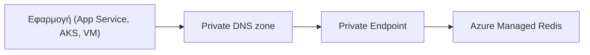

# Μετάβαση σε Azure Managed Redis

## 1. Πεδίο και Στόχοι της Μετάβασης

Στόχος είναι η μετάβαση των Azure Cache for Redis (Standard και Premium) σε Azure Managed Redis (AMR), στην περιοχή West Europe. Η τελική λίστα των caches προς μετάβαση δεν έχει οριστικοποιηθεί και μπορεί να περιλαμβάνει λιγότερα από 7 instances.

### Υφιστάμενη Απογραφή Redis Caches

| Cache | Μέγεθος | SKU | Περιβάλλον |
| --- | --- | --- | --- |
| `redis-cytaweb-test-standard-we-02` | 1 GB | Standard | Test |
| `redis-cytaweb-test-v6` | 1 GB | Standard | Test |
| `redis-cytaweb-dev-we-01` | 1 GB | Standard | Dev |
| `redis-cytaweb-qa` | 1 GB | Standard | QA |
| `redis-cytaweb-qa-we-01` | 1 GB | Standard | QA |
| `redis-cytaweb-premium-prod` | 6 GB | Premium | Production |
| `redis-cytaweb-prod-we-01` | 6 GB | Premium | Production |

### Προτεινόμενα Κύματα Μετάβασης

| Κύμα | Caches | Αρχικός στόχος AMR |
| --- | --- | --- |
| 1 | Τα δύο Test | Balanced B1 |
| 2 | Dev | Balanced B1 |
| 3 | Τα δύο QA | Balanced B1, HA |
| 4 | `redis-cytaweb-premium-prod` | Balanced B5, HA |
| 5 | `redis-cytaweb-prod-we-01` | Balanced B5, HA |

### Ρόλοι και Όρια Ευθύνης

- **Από εμάς:** δημιουργία των AMR, μετάβαση δεδομένων, ενσωμάτωση Private Endpoint, VNet, DNS και διαγραφή του παλιού cache μετά από επιτυχή δοκιμή.
- **Από την ομάδα της Cyta:** ενημέρωση του application configuration στο νέο AMR endpoint.

## 2. Επισκόπηση Azure Managed Redis

### Γιατί Azure Managed Redis

- Βασίζεται στο Redis Enterprise αντί του Redis OSS.
- Εκτελεί πολλαπλά shards ανά node και αξιοποιεί περισσότερα vCPU, με δυνατότητα υψηλότερου throughput και χαμηλότερης latency (χωρίς εγγυημένο συντελεστή).
- Active geo-replication, persistence και import/export σε όλα τα SKU, καθώς και Redis modules.

### Βασικές Διαφορές από το Azure Cache for Redis

| Θέμα | Υφιστάμενο Redis | Azure Managed Redis |
| --- | --- | --- |
| Μηχανή | Redis OSS | Redis Enterprise |
| Έκδοση Redis | 6.0 | 7.4 |
| Θύρα | 6380 (TLS) / 6379 | 10000 |
| Hostname | `<name>.redis.cache.windows.net` | `<name>.<region>.redis.azure.net` |
| Logical databases | Πολλαπλά | Μόνο database 0 |
| Δίκτυο | VNet injection / firewall | Μόνο Private Link |

### Αρχιτεκτονική-Στόχος

## 3. Διαστασιολόγηση, Διαθεσιμότητα και Clustering

### Επιλογή Μεγέθους Μνήμης και Performance Tier

Το AMR δεσμεύει περίπου 20% της συνολικής μνήμης για λειτουργίες συστήματος, replication και overhead:

$$\text{απαιτούμενη συνολική μνήμη AMR} = \frac{\text{peak usable memory}}{0.80}$$

| Tier | Χρήση |
| --- | --- |
| Balanced | Αρχική επιλογή για άγνωστο ή ισορροπημένο workload |
| Memory Optimized | Όταν η πίεση μνήμης προηγείται του CPU/network |
| Compute Optimized | Throughput-intensive ή latency-sensitive workloads |
| Flash Optimized | Πολύ μεγάλα read-heavy datasets· δεν ταιριάζει στα caches των 1/6 GB |

### Υψηλή Διαθεσιμότητα και Πλεονασμός Ζωνών

- HA υποχρεωτική για QA και Production. Το non-HA επιτρέπεται μόνο για Dev/Test με δεδομένα που ξαναγεμίζουν και δεν έχει SLA.
- Σε περιοχές με Availability Zones, το HA AMR είναι zone-redundant by default.
- Το zone redundancy δεν αντικαθιστά τα client retries ούτε το regional DR.
- Τα υφιστάμενα caches είναι όλα στο West Europe· το geo-replication είναι ξεχωριστή πρωτοβουλία DR.

### Πολιτικές OSS, Enterprise και Nonclustered

| Πολιτική | Πότε επιλέγεται | Κρίσιμη επίπτωση |
| --- | --- | --- |
| OSS clustering | Default για cluster-aware clients | Ο client ακολουθεί `MOVED`· δεν υποστηρίζεται RediSearch |
| Enterprise clustering | RediSearch ή legacy clients | Ένα proxy endpoint, πιθανό bottleneck |
| Nonclustered | Μόνο ως εξαίρεση συμβατότητας | Έως 25 GB, χαμηλότερη απόδοση |

Η πολιτική επιλέγεται κατά τη δημιουργία και δεν αλλάζει χωρίς νέο resource. Αρχική επιλογή: OSS clustering.

## 4. Δίκτυο, Ασφάλεια και Πρόσβαση

### Ενσωμάτωση Private Endpoint και DNS

1. Δημιουργία Private Endpoint για κάθε AMR.
2. Σύνδεση private DNS zone στα VNets των εφαρμογών.

Το AMR δεν υποστηρίζει VNet injection ή IP-based firewall rules.

### TLS και Πιστοποίηση Χρηστών

- Μόνο TLS (1.2 και 1.3), θύρα 10000. Δεν υπάρχει ταυτόχρονη λειτουργία TLS και non-TLS.
- Στόχος: Microsoft Entra ID με managed identities. Τα access keys μόνο ως μεταβατική λύση.
- Δεν αποθηκεύονται keys ή tokens σε αρχεία markdown ή Git.

### Απαιτήσεις Συνδεσιμότητας των Clients

- Νέο hostname, θύρα 10000, νέο key ή Entra token και νέα διαδρομή DNS.
- Χρήση DNS hostname, ποτέ στατικής IP.
- Connection pooling και retry με jitter για σύντομα reconnect blips σε scaling/failover.

## 5. Συμβατότητα Εφαρμογών

Οι περισσότερες εφαρμογές χρειάζονται αλλαγή configuration και όχι ξαναγράψιμο κώδικα.

### Διαφορές Έκδοσης Redis και Πλατφόρμας

- Redis 6.0 → 7.4: οι βασικές δομές και εντολές παραμένουν συμβατές, αλλά η μετάβαση δεν είναι in-place upgrade. Κάθε εφαρμογή δοκιμάζεται στο νέο endpoint πριν το cutover.
- Νέες δυνατότητες (Redis Functions, sharded Pub/Sub, `HEXPIRE`) είναι προαιρετικές.
- Δεν υποστηρίζονται keyspace notifications και manual reboot.

### Υποστήριξη Client Library και Cluster

- Έλεγχος για TLS, αυτόματο reconnect, Redis Cluster API και `MOVED` redirects.
- Multi-key εντολές, Lua και `MULTI/EXEC` απαιτούν keys στο ίδιο hash slot, π.χ. `{customer:42}:profile`.

### Περιορισμοί Μοντέλου Δεδομένων και Δυνατοτήτων

- Μόνο database 0: το `SELECT <db>` αντικαθίσταται από prefixes στα keys.
- Τα Redis modules (RedisJSON, RedisBloom, RedisTimeSeries, RediSearch) επιλέγονται κατά τη δημιουργία και όχι αργότερα.
- Τα δεδομένα ταξινομούνται σε rehydratable cache, session/queue/lock και business state.

## 6. Μετάβαση Δεδομένων και Cutover

### Επιλογές Στρατηγικής Μετάβασης

| Μέθοδος | Πότε επιλέγεται | Περιορισμός |
| --- | --- | --- |
| Cold start / cache warming | Cache-aside, δεδομένα που ξαναγεμίζουν | Φόρτος cache-miss στην πηγή δεδομένων |
| RDB export/import | Premium source, αποδεκτό point-in-time snapshot | Δεν περιλαμβάνει writes μετά το export |
| Dual write | Μηδενική απώλεια state | Απαιτεί αλλαγή εφαρμογής και idempotency |
| Programmatic copy | Ειδικά ή μεγάλα datasets | Κόστος εργαλείων και reconciliation |

Το built-in migration tooling (preview) δεν μεταφέρει δεδομένα και δεν υποστηρίζει Private Endpoint, επομένως δεν χρησιμοποιείται ως βασική μέθοδος.

### Επικύρωση και Συμφωνία Δεδομένων

- Σύγκριση key count, δειγμάτων τιμών και κατανομής TTL.
- Έλεγχος business invariants, σφαλμάτων εντολών και p95/p99 latency.
- Δοκιμή reconnect και failover συμπεριφοράς με αντιπροσωπευτικά δεδομένα και φόρτο.

### Προσέγγιση Cutover και Rollback

1. Write freeze ή idempotent dual write για την κάλυψη των writes μετά το snapshot.
2. Σταδιακή μεταφορά των reads και αλλαγή του application hostname στο νέο AMR endpoint.
3. Το παλιό cache παραμένει διαθέσιμο για το συμφωνημένο rollback window.
4. Διαγραφή του παλιού cache από τον πελάτη μετά από επιτυχή δοκιμή.

## 7. Πλάνο Υλοποίησης

### Ακολουθία Ανά Περιβάλλον

Test → Dev → QA → πρώτο Production → δεύτερο Production, όπως στα κύματα της ενότητας 1.

### Κριτήρια Δοκιμών και Αποδοχής

- Επιτυχής σύνδεση TLS με Entra authentication από κάθε workload.
- Επιτυχής regression/integration suite στο νέο endpoint.
- Ολοκληρωμένη συμφωνία δεδομένων (count, samples, TTL, business invariants).

### Επόμενα Βήματα και Απαιτούμενες Αποφάσεις

- Οριστικοποίηση των caches που θα μεταφερθούν.
- Μέτρηση peak `used_memory`, fragmentation, evictions, throughput και connections για τελική διαστασιολόγηση.
- Επιλογή clustering policy, modules και persistence πριν τη δημιουργία.
- Επιλογή μεθόδου μετάβασης δεδομένων ανά cache και συμφωνία rollback window.
