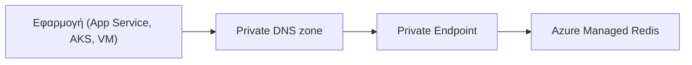
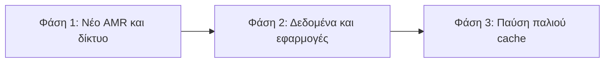

# Μετάβαση σε Azure Managed Redis

## 1. Πεδίο και Στόχοι της Μετάβασης

Στόχος είναι η μετάβαση των Azure Cache for Redis (Standard και Premium) σε Azure Managed Redis (AMR), στην περιοχή West Europe. Η τελική λίστα των caches προς μετάβαση δεν έχει οριστικοποιηθεί και μπορεί να περιλαμβάνει λιγότερα από 7 instances.

### Υφιστάμενη Απογραφή Redis Caches

| Cache | Μέγεθος | SKU | Περιβάλλον |
| --- | --- | --- | --- |
| `redis-cytaweb-test-standard-we-02` | 1 GB | Standard | Test |
| `redis-cytaweb-test-v6` | 1 GB | Standard | Test |
| `redis-cytaweb-dev-we-01` | 1 GB | Standard | Dev |
| `redis-cytaweb-qa` | 1 GB | Standard | QA |
| `redis-cytaweb-qa-we-01` | 1 GB | Standard | QA |
| `redis-cytaweb-premium-prod` | 6 GB | Premium | Production |
| `redis-cytaweb-prod-we-01` | 6 GB | Premium | Production |

### Προτεινόμενα Κύματα Μετάβασης

| Κύμα | Caches | Αρχικός στόχος AMR |
| --- | --- | --- |
| 1 | Τα δύο Test | Balanced B1 |
| 2 | Dev | Balanced B1 |
| 3 | Τα δύο QA | Balanced B1, HA |
| 4 | `redis-cytaweb-premium-prod` | Balanced B5, HA |
| 5 | `redis-cytaweb-prod-we-01` | Balanced B5, HA |

### Ρόλοι και Όρια Ευθύνης

- **Από εμάς:** δημιουργία των AMR, μετάβαση δεδομένων, ενσωμάτωση Private Endpoint, VNet, DNS και διαγραφή του παλιού cache μετά από επιτυχή δοκιμή.
- **Από την ομάδα της Cyta:** ενημέρωση του application configuration στο νέο AMR endpoint.

## 2. Επισκόπηση Azure Managed Redis

### Γιατί Azure Managed Redis

- Βασίζεται στο Redis Enterprise αντί του Redis OSS.
- Εκτελεί πολλαπλά shards ανά node και αξιοποιεί περισσότερα vCPU, με δυνατότητα υψηλότερου throughput και χαμηλότερης latency (χωρίς εγγυημένο συντελεστή).
- Active geo-replication, persistence και import/export σε όλα τα SKU, καθώς και Redis modules.

### Βασικές Διαφορές από το Azure Cache for Redis

| Θέμα | Υφιστάμενο Redis | Azure Managed Redis |
| --- | --- | --- |
| Μηχανή | Redis OSS | Redis Enterprise |
| Έκδοση Redis | 6.0 | 7.4 |
| Θύρα | 6380 (TLS) / 6379 | 10000 |
| Hostname | `<name>.redis.cache.windows.net` | `<name>.<region>.redis.azure.net` |
| Logical databases | Πολλαπλά | Μόνο database 0 |
| Δίκτυο | VNet injection / firewall | Μόνο Private Link |

### Αρχιτεκτονική-Στόχος

## 3. Διαστασιολόγηση

### Επιλογή Μεγέθους Μνήμης και Performance Tier

Το AMR δεσμεύει περίπου 20% της συνολικής μνήμης για λειτουργίες συστήματος, replication και overhead:

$$\text{απαιτούμενη συνολική μνήμη AMR} = \frac{\text{peak usable memory}}{0.80}$$

| Tier | Χρήση |
| --- | --- |
| Balanced | Αρχική επιλογή για άγνωστο ή ισορροπημένο workload |
| Memory Optimized | Όταν η πίεση μνήμης προηγείται του CPU/network |
| Compute Optimized | Throughput-intensive ή latency-sensitive workloads |
| Flash Optimized | Πολύ μεγάλα read-heavy datasets· δεν ταιριάζει στα caches των 1/6 GB |

## 4. Δίκτυο, Ασφάλεια και Πρόσβαση

### Ενσωμάτωση Private Endpoint και DNS

1. Δημιουργία Private Endpoint για κάθε AMR.
2. Σύνδεση private DNS zone στα VNets των εφαρμογών.

Το AMR δεν υποστηρίζει VNet injection ή IP-based firewall rules.

### TLS και Πιστοποίηση Χρηστών

- Μόνο TLS (1.2 και 1.3), θύρα 10000. Δεν υπάρχει ταυτόχρονη λειτουργία TLS και non-TLS.
- Στόχος: Microsoft Entra ID με managed identities. Τα access keys μόνο ως μεταβατική λύση.

### Απαιτήσεις Συνδεσιμότητας των Clients

- Νέο hostname, θύρα 10000, νέο key ή Entra token και νέα διαδρομή DNS.
- Χρήση DNS hostname, ποτέ στατικής IP.

## 5. Συμβατότητα Εφαρμογών

Οι περισσότερες εφαρμογές χρειάζονται αλλαγή configuration και όχι ξαναγράψιμο κώδικα. Κάθε εφαρμογή δοκιμάζεται στο νέο endpoint πριν το cutover.

### Δεν υποστηρίζεται πλέον και απαιτεί αλλαγή στον τρέχοντα κώδικα

- **Connection:** νέο hostname, θύρα 10000 και μόνο TLS (όχι ταυτόχρονα TLS και non-TLS).
- **Logical databases:** μόνο database 0· το `SELECT <db>` αντικαθίσταται από prefixes στα keys.
- **Keyspace notifications:** δεν υποστηρίζονται· αντικαθίστανται από application events, queues ή scheduler.
- **Manual reboot:** δεν υποστηρίζεται.
- **Multi-key εντολές, Lua και `MULTI/EXEC` (OSS clustering):** τα keys πρέπει να είναι στο ίδιο hash slot, π.χ. `{customer:42}:profile`.
- **Client library:** απαιτείται υποστήριξη TLS, αυτόματου reconnect, Redis Cluster API και `MOVED` redirects.
- **Δίκτυο:** δεν υποστηρίζονται VNet injection και IP-based firewall rules· η πρόσβαση γίνεται μέσω Private Endpoint.

### Νέες δυνατότητες που μπορούμε να χρησιμοποιήσουμε

- **Redis Functions** (`FUNCTION`, `FCALL`) ως εναλλακτική των Lua scripts.
- **Sharded Pub/Sub** (`SSUBSCRIBE`) σε cluster.
- **Expiry σε hash fields** (`HEXPIRE`).
- **Microsoft Entra ID με managed identities** αντί για access keys.
- **Redis modules** (RedisJSON, RedisBloom, RedisTimeSeries, RediSearch), που επιλέγονται κατά τη δημιουργία.
- **Active geo-replication** και **persistence** σε όλα τα SKU.
- **Scaling** μνήμης και performance tier χωρίς αλλαγή resource.

Οι νέες δυνατότητες είναι προαιρετικές και ενεργοποιούνται μόνο μετά από δοκιμές στην εφαρμογή.

### Redis Modules

Τα modules επεκτείνουν το Redis με επιπλέον δομές δεδομένων και λειτουργίες. Επιλέγονται μόνο κατά τη δημιουργία του AMR και δεν μπορούν να προστεθούν ή να αφαιρεθούν αργότερα. Δεν υπάρχει ξεχωριστή χρέωση ανά module στην τεκμηρίωση, αλλά καταναλώνουν μνήμη και CPU.

| Module | Τι κάνει | Παράδειγμα χρήσης | Περιορισμοί |
| --- | --- | --- | --- |
| RedisJSON | Αποθηκεύει και ενημερώνει έγγραφα JSON, με πρόσβαση σε επιμέρους πεδία χωρίς ανάγνωση ολόκληρου του αντικειμένου. | Προφίλ χρηστών, καταλόγος προϊόντων | Διαθέσιμο σε όλα τα tiers, συμπεριλαμβανομένου του Flash Optimized. |
| RediSearch | Ευρετήρια και αναζήτηση: full-text, πολλαπλά πεδία, aggregations και vector similarity (KNN). | Αναζήτηση προϊόντων, vector search για AI | Απαιτεί clustering policy `Enterprise` και eviction policy `NoEviction`. Δεν υποστηρίζεται στο Flash Optimized. |
| RedisBloom | Πιθανοτικές δομές (Bloom/Cuckoo filter, Count-min sketch, Top-k) με μικρή μνήμη και μικρή ανακρίβεια. | Έλεγχος αν έχει σταλεί ήδη email, κορυφαία στοιχεία σε stream | Δεν υποστηρίζεται στο Flash Optimized ή με active geo-replication. |
| RedisTimeSeries | Χρονοσειρές υψηλής εισροής, με aggregations, downsampling και retention. | IoT telemetry, monitoring | Δεν υποστηρίζεται στο Flash Optimized ή με active geo-replication. |

Ο προεπιλεγμένος σχεδιασμός για τα caches μας είναι χωρίς modules, εκτός αν τεκμηριωθεί use case πριν τη δημιουργία.

## 6. Μετάβαση Δεδομένων και Cutover

### Επιλογές Στρατηγικής Μετάβασης

| Μέθοδος | Πότε επιλέγεται | Περιορισμός |
| --- | --- | --- |
| Cold start / cache warming | Cache-aside, δεδομένα που ξαναγεμίζουν | Φόρτος cache-miss στην πηγή δεδομένων |
| RDB export/import | Premium source, αποδεκτό point-in-time snapshot | Δεν περιλαμβάνει writes μετά το export |
| Dual write | Μηδενική απώλεια state | Απαιτεί αλλαγή εφαρμογής και idempotency |
| Programmatic copy | Ειδικά ή μεγάλα datasets | Κόστος εργαλείων και reconciliation |

Το built-in migration tooling (preview) δεν μεταφέρει δεδομένα και δεν υποστηρίζει Private Endpoint, επομένως δεν χρησιμοποιείται ως βασική μέθοδος.

## 7. Πλάνο Υλοποίησης

### Ακολουθία Ανά Περιβάλλον

Test → Dev → QA → πρώτο Production → δεύτερο Production, όπως στα κύματα της ενότητας 1.

### Φάσεις Υλοποίησης

Οι φάσεις εκτελούνται ανά κύμα. Δεν ξεκινά η επόμενη φάση χωρίς ολοκλήρωση των κριτηρίων εξόδου της προηγούμενης.

#### Φάση 1: Δημιουργία AMR και Δικτύωση

**1.1 Δημιουργία νέου Azure Managed Redis**

1. Τελική διαστασιολόγηση μνήμης και επιλογή tier.
2. Επιλογή modules και persistence, που δεν αλλάζουν μετά τη δημιουργία.
3. Δημιουργία στην West Europe, με `publicNetworkAccess` απενεργοποιημένο, HA στα QA/Production.

**1.2 Ρύθμιση δικτύου (Private Endpoint, firewall, routes)**

| Στοιχείο | Ενέργεια |
| --- | --- |
| Private Endpoint | Ένα ανά AMR, στο subnet των Private Endpoints, για το sub-resource `redisEnterprise`, με auto-approval. |
| Private DNS | Zone `privatelink.redis.azure.net`, με DNS zone group στο Private Endpoint και σύνδεση (VNet link) σε όλα τα VNets των εφαρμογών και των on-premises DNS forwarders. |
| Firewall / NSG | Το AMR δεν έχει IP firewall rules. Επιτρέπεται TCP 10000 από τα subnets των εφαρμογών προς το subnet του Private Endpoint, ενώ το υπόλοιπο traffic απορρίπτεται. Αφαιρούνται οι κανόνες για τις θύρες 6379/6380 του παλιού cache μόνο στη Φάση 3. |
| Routes (UDR) | Αν το traffic περνά από Azure Firewall ή NVA, ενεργοποιούνται τα network policies του subnet του Private Endpoint και προστίθεται route /32 προς το Private Endpoint, ώστε να υπάρχει συμμετρική διαδρομή. Διαφορετικά δεν απαιτούνται custom routes. |

**Κριτήρια εξόδου Φάσης 1**

- Το AMR είναι σε κατάσταση `Running` και το Private Endpoint σε `Approved`.
- Από κάθε subnet εφαρμογής, το `<name>.<region>.redis.azure.net` επιλύεται σε private IP.
- Επιτυχής σύνδεση TLS στη θύρα 10000 (`PING`) με Entra token.

#### Φάση 2: Μετάβαση Δεδομένων και Ενημέρωση Εφαρμογών

**2.1 Μετάβαση δεδομένων (αν χρειάζεται)**

| Κατάσταση | Ενέργεια |
| --- | --- |
| Cache-aside, τα δεδομένα ξαναγεμίζουν | Χωρίς μεταφορά, cold start με cache warming. Προτείνεται για Test, Dev και QA. |
| Τα δεδομένα πρέπει να διατηρηθούν | RDB export του παλιού cache (Premium) σε Storage account και import στο AMR. Τα writes μετά το export χάνονται, άρα γίνεται σε παράθυρο χαμηλής κίνησης ή με παύση των writes. |

Πριν τη μεταφορά ελέγχεται ότι δεν χρησιμοποιούνται logical databases πέραν του 0.

**Κριτήρια εξόδου Φάσης 2**

- Όλα τα workloads συνδέονται στο νέο endpoint χωρίς σφάλματα.
- Μηδενική κίνηση (connections και commands) στο παλιό cache για τον συμφωνημένο χρόνο παρατήρησης.

#### Φάση 3: Παύση του Παλιού Cache

1. **Rollback window:** το παλιό cache μένει ενεργό και read-only/αδρανές για τον συμφωνημένο χρόνο (προτείνεται 1 εβδομάδα στα Production), ώστε να υπάρχει δυνατότητα επιστροφής με απλή αλλαγή configuration.
2. **Διαγραφή** του παλιού cache και του Private Endpoint του, αφού επιβεβαιωθεί γραπτά από την ομάδα της Cyta.
3. **Καθαρισμός δικτύου:** αφαίρεση των εγγραφών `privatelink.redis.cache.windows.net`, των NSG/firewall κανόνων για τις θύρες 6379/6380 και των παλιών secrets στο Key Vault.

**Κριτήρια εξόδου Φάσης 3**

- Το παλιό cache και τα εξαρτώμενα resources έχουν διαγραφεί.
- Δεν υπάρχουν alerts ή σφάλματα εφαρμογών για το rollback window.

