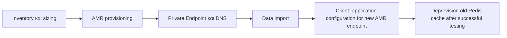
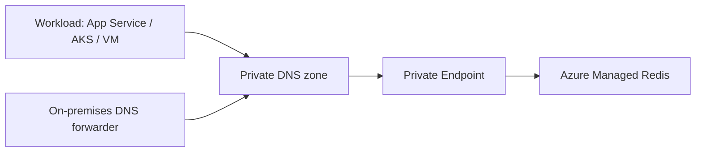

# Azure Managed Redis - Πλήρης Τεχνική Αναφορά Provisioning

**Σκοπός:** πλήρης τεχνική αναφορά για μετάβαση Azure Cache for Redis Basic, Standard και Premium σε Azure Managed Redis (AMR).  
**Περιοχή:** West Europe.  
**Υλοποίηση από εμάς:** target AMR resources, data migration, Private Endpoint/VNet/DNS integration

## 1. Inventory

| Name | Location | Status | Size | SKU | Subscription | Resource link |
| --- | --- | --- | --- | --- | --- | --- |
| `redis-cytaweb-dev-we-01` | West Europe | Running | 1 GB | Standard | Cyta Dev Environment | [Portal](https://portal.azure.com#resource/subscriptions/61e13f14-79e8-46f5-a690-b438810c9425/resourceGroups/CytaWebSiteDev/providers/Microsoft.Cache/Redis/redis-cytaweb-dev-we-01) |
| `redis-cytaweb-premium-prod` | West Europe | Running | 6 GB | Premium | Cyta Production Environment | [Portal](https://portal.azure.com#resource/subscriptions/75fbc94c-0d25-434d-9fd2-6719b79ebd84/resourceGroups/CytaWebSiteProd/providers/Microsoft.Cache/Redis/redis-cytaweb-premium-prod) |
| `redis-cytaweb-prod-we-01` | West Europe | Running | 6 GB | Premium | Cyta Production Environment | [Portal](https://portal.azure.com#resource/subscriptions/75fbc94c-0d25-434d-9fd2-6719b79ebd84/resourceGroups/CytaWebSiteProd/providers/Microsoft.Cache/Redis/redis-cytaweb-prod-we-01) |
| `redis-cytaweb-qa` | West Europe | Running | 1 GB | Standard | Cyta QA Environment | [Portal](https://portal.azure.com#resource/subscriptions/7bb87719-8b7f-4cf5-9759-6051ba7eb0b5/resourceGroups/CytaWebSiteQA/providers/Microsoft.Cache/Redis/redis-cytaweb-qa) |
| `redis-cytaweb-qa-we-01` | West Europe | Running | 1 GB | Standard | Cyta QA Environment | [Portal](https://portal.azure.com#resource/subscriptions/7bb87719-8b7f-4cf5-9759-6051ba7eb0b5/resourceGroups/CytaWebSiteQA/providers/Microsoft.Cache/Redis/redis-cytaweb-qa-we-01) |
| `redis-cytaweb-test-standard-we-02` | West Europe | Running | 1 GB | Standard | Cyta Test Environment | [Portal](https://portal.azure.com#resource/subscriptions/bc72ff26-44bb-4263-8e1d-426c5c3d1eb3/resourceGroups/CytaWebSiteTest/providers/Microsoft.Cache/Redis/redis-cytaweb-test-standard-we-02) |
| `redis-cytaweb-test-v6` | West Europe | Running | 1 GB | Standard | Cyta Test Environment | [Portal](https://portal.azure.com#resource/subscriptions/bc72ff26-44bb-4263-8e1d-426c5c3d1eb3/resourceGroups/CytaWebSiteTest/providers/Microsoft.Cache/Redis/redis-cytaweb-test-v6) |

Το inventory περιλαμβάνει και τα 7 Redis caches που είναι γνωστά σήμερα. Η τελική επιλογή των caches για μετάβαση δεν έχει ακόμη καθοριστεί και μπορεί να περιλαμβάνει λιγότερα από 7 instances.

## 2. Provisioning waves

Οι παρακάτω waves δείχνουν την ενδεικτική σειρά για όσα caches επιλεγούν για μετάβαση: Test → Dev → QA → πρώτο Production → δεύτερο Production.

| Wave | Caches | Initial AMR target | Σκοπός |
| --- | --- | --- | --- |
| 1 | Τα δύο Test | Balanced B1 | AMR provisioning και data import |
| 2 | Dev | Balanced B1 | AMR provisioning και data import |
| 3 | Τα δύο QA | Balanced B1, HA | AMR provisioning και data import |
| 4 | `redis-cytaweb-premium-prod` | Balanced B5, HA | AMR provisioning και data import |
| 5 | `redis-cytaweb-prod-we-01` | Balanced B5, HA | AMR provisioning και data import |

### Επόμενα στάδια από τον πελάτη

6. Ο πελάτης ενημερώνει το application configuration ώστε οι εφαρμογές να χρησιμοποιούν το νέο AMR endpoint.
7. Μετά από επιτυχή testing του πελάτη, ο πελάτης κάνει deprovision το παλιό Redis cache.

Τα στάδια 6 και 7 εκτελούνται από τον πελάτη και δεν περιλαμβάνονται στο δικό μας scope.

Τα B1/B5 είναι οι προτεινόμενες αρχικές διαμορφώσεις των resources.

## 3. Γιατί AMR

Το AMR χρησιμοποιεί Redis Enterprise αντί OSS Redis. Το Redis Enterprise εκτελεί πολλαπλά shards ανά node και αξιοποιεί περισσότερα vCPU για command processing. Αυτό επιτρέπει υψηλότερο potential throughput και καλύτερη latency, χωρίς να εγγυάται συγκεκριμένο multiplier.

Επιπλέον δυνατότητες: active geo-replication, persistence και import/export σε όλα τα AMR SKU, καθώς και Redis modules. Αυτές επιλέγονται βάσει ανάγκης και δεν είναι από μόνες τους λόγος για αλλαγή application architecture.

## 4. SKU, usable memory και performance tier

Το AMR διαστασιολογείται σε δύο ανεξάρτητους άξονες: συνολική μνήμη και performance tier.

### 4.1 Memory size

Το AMR κρατά περίπου 20% συνολικής μνήμης για system operations, replication/failover buffer και overhead.

$$\text{required AMR total memory} = \frac{\text{peak usable memory}}{0.80}$$

Η επιλογή μεγέθους λαμβάνει υπόψη `Used Memory`, peak fragmentation, evictions, key count και TTL distribution. Συγκριτικά, το legacy ACR συχνά εκτιμάται με περίπου 10% reservation. Δεν επιλέγουμε target μόνο από 1 GB ή 6 GB nominal size. Για 10 GB usable demand απαιτούνται τουλάχιστον 12.5 GB total AMR memory.

### 4.2 Performance tier

| Tier | Χρήση |
| --- | --- |
| Balanced | Αρχική επιλογή για άγνωστο ή ισορροπημένο workload. |
| Memory Optimized | Memory pressure φτάνει πριν CPU/network bottleneck. |
| Compute Optimized | Throughput-intensive ή latency-sensitive workload με CPU/bandwidth pressure. |
| Flash Optimized | Πολύ μεγάλα read-heavy datasets με hot/cold access pattern. Δεν είναι κατάλληλο default για αυτά τα 1/6 GB caches. |

### 4.3 Scaling

Το AMR επιτρέπει αλλαγή memory size και performance tier. Με HA αναμένονται σύντομα reconnect blips κατά scaling/failover, επομένως οι clients χρειάζονται pooling και retry with jitter. Το scale-down απαιτεί memory usage χαμηλότερη από το νέο usable capacity και επηρεάζεται από shard/vCPU compatibility. Δεν αλλάζει clustering policy με scaling και δεν γίνεται μετάβαση μεταξύ in-memory και Flash Optimized tiers. Χρησιμοποιούμε DNS hostname, ποτέ στατική IP.

## 5. HA, zone redundancy και geo-replication

### High availability

Με HA, primary και replica shards αναπτύσσονται σε τουλάχιστον δύο nodes. HA είναι υποχρεωτική επιλογή για QA/Production. Non-HA είναι κατάλληλο μόνο για rehydratable Dev/Test, δεν έχει SLA και μπορεί να χάσει data σε maintenance.

### Zone redundancy

Σε region με Availability Zones, HA AMR είναι zone-redundant by default. Προσφέρει ανθεκτικότητα σε zone failure, αλλά δεν αντικαθιστά client retries ούτε regional DR.

### Geo-replication

Το AMR παρέχει active geo-replication, με reads/writes σε linked caches διαφορετικών περιοχών. Το legacy Premium προσφέρει passive geo-replication με read-only secondary. Δεν υπάρχει explicit AMR `Failover` command: η εφαρμογή μεταβαίνει σε άλλο endpoint σε regional outage. Εφόσον όλα τα current caches είναι West Europe, το geo-replication είναι ανεξάρτητη DR πρωτοβουλία.

## 6. Redis OSS, Redis Enterprise και clustering

| Θέμα | Legacy OSS Redis | AMR Redis Enterprise |
| --- | --- | --- |
| Command execution | Single-threaded ανά Redis server process | Πολλά parallel shards ανά node |
| vCPU use | Περιορισμένο command parallelism | Καλύτερη αξιοποίηση πολλών vCPU |
| Node behavior | Primary/replica node roles | Primaries και replicas κατανέμονται σε nodes |
| Connection handling | OSS endpoint model | Proxy, connection management και self-healing stack |

Το AMR είναι clustered by default. Η policy επιλέγεται πριν το create και δεν αλλάζει χωρίς recreation.

| Policy | Επιλογή | Κρίσιμη επίπτωση |
| --- | --- | --- |
| OSS clustering | Default για cluster-aware clients | Υψηλή throughput/χαμηλή latency. Client ακολουθεί `MOVED`; RediSearch δεν υποστηρίζεται. |
| Enterprise clustering | RediSearch ή legacy client compatibility | Single proxy endpoint, αλλά πιθανό compute/network bottleneck. |
| Nonclustered | Μόνο όταν η εφαρμογή δεν ανέχεται cluster topology | Έως 25 GB και χαμηλότερη performance. |

### 6.1 Πώς λειτουργεί κάθε clustering policy

| Policy | Routing και data distribution | Συμπεριφορά εφαρμογής | Πότε επιλέγεται |
| --- | --- | --- | --- |
| OSS clustering | Τα keys κατανέμονται σε hash slots και shards. Ο client λαμβάνει cluster topology και ακολουθεί τις απαντήσεις `MOVED` προς το shard που κατέχει το key. | Απαιτεί Redis Cluster-aware client. Multi-key commands, transactions και Lua scripts λειτουργούν μόνο όταν όλα τα keys είναι στο ίδιο slot. | Default επιλογή για νέο workload που υποστηρίζει Redis Cluster και χρειάζεται την καλύτερη throughput/latency συμπεριφορά. |
| Enterprise clustering | Redis Enterprise proxy δέχεται το connection και δρομολογεί εσωτερικά τα requests στα shards, χωρίς να εκθέτει `MOVED` redirects στον client. | Απλοποιεί legacy-client compatibility και υποστηρίζει RediSearch. Το proxy μπορεί να γίνει compute/network bottleneck σε υψηλό throughput. | Όταν απαιτείται RediSearch ή ο client δεν μπορεί να υποστηρίξει OSS Cluster protocol. |
| Nonclustered | Ένα nonclustered logical database χωρίς cluster slot routing. Δεν αξιοποιεί sharding για parallel command processing. | Δεν απαιτεί Cluster API ή `MOVED` handling. Δεν υπάρχει cross-slot restriction, αλλά η κλιμάκωση και το performance envelope είναι μικρότερα. | Μόνο ως compatibility exception όταν η εφαρμογή δεν μπορεί να προσαρμοστεί σε clustered topology. Μέγιστο μέγεθος 25 GB. |

Η clustering policy είναι create-time επιλογή. Η αλλαγή από OSS σε Enterprise ή Nonclustered, ή το αντίστροφο, απαιτεί νέο AMR resource και migration/cutover. Δεν την επιλέγουμε μόνο για να αποφύγουμε ένα client test: για τα συγκεκριμένα caches η αρχική επιλογή είναι OSS clustering, εκτός αν ο compatibility assessment τεκμηριώσει εξαίρεση.

Για OSS policy, multi-key commands, Lua και `MULTI/EXEC` πρέπει να έχουν keys στο ίδιο hash slot. Χρησιμοποιούμε hash tags όπως `{customer:42}:profile` και `{customer:42}:orders`. Στο Enterprise policy cross-slot επιτρέπονται μόνο `DEL`, `MSET`, `MGET`, `EXISTS`, `UNLINK` και `TOUCH`.

## 7. Network integration

Το AMR δεν υποστηρίζει VNet injection ή IP-based firewall rules. Για private workloads εφαρμόζουμε Azure Private Link.

### Provisioning

1. Δημιουργούμε Private Endpoint για κάθε private target AMR.
2. Συνδέουμε private DNS zone στα workload VNet.
3. Ρυθμίζουμε DNS forwarding για on-premises routes όπου απαιτείται.

Το target hostname είναι `<name>.<region>.redis.azure.net`, αντί για `<name>.redis.cache.windows.net`.

## 8. TLS και authentication

TLS κρυπτογραφεί commands, values και credentials στη μεταφορά και χρησιμοποιεί server certificate.

| Ρύθμιση | Legacy cache | AMR |
| --- | --- | --- |
| TLS port | 6380 | 10000 |
| Non-TLS port | 6379 | 10000 |
| Ταυτόχρονο TLS/non-TLS | Ναι | Όχι |
| TLS versions | 1.2, 1.3 | 1.2, 1.3 |

Επιλέγουμε TLS. Στο AMR όλοι οι clients ενός cache χρησιμοποιούν το ίδιο mode, ορισμένο στο provisioning. Το AMR υποστηρίζει Microsoft Entra ID authentication και access keys. Στόχος είναι Entra ID + managed identities όπου υποστηρίζεται· access keys χρησιμοποιούνται μόνο ως μεταβατική compatibility επιλογή. Δεν αποθηκεύουμε keys/tokens σε markdown ή Git.

## 9. Application compatibility

Οι περισσότερες εφαρμογές χρειάζονται αλλαγή configuration, όχι business-code rewrite. Το minimum connection update είναι νέο hostname, port 10000, νέο key/Entra token και νέο DNS route.

| Compatibility area | Έλεγχος |
| --- | --- |
| Client library | TLS, automatic reconnect, Redis Cluster API, `MOVED` redirects |
| Redis version | AMR 7.4 αντί legacy 6.x· tests για commands/scripts |
| Multi-key logic | Hash tags ή redesign για same-slot keys |
| Logical databases | AMR έχει database 0 μόνο· αντικατάσταση `SELECT <db>` με prefixes |
| Keyspace notifications | Δεν υποστηρίζονται· αντικατάσταση event consumers με app event, queue ή scheduler |
| Manual reboot | Δεν υποστηρίζεται· Flush μόνο για clearing target data |
| Scheduled updates | Preview· όχι dependency του rollout |

### 9.1 Redis 7.4 στο AMR σε σύγκριση με Redis 6.0

Τα current caches χρησιμοποιούν Redis 6.0, ενώ το AMR χρησιμοποιεί Redis 7.4. Οι βασικές Redis data structures και τα συνήθη commands (`GET`, `SET`, hashes, lists, sets, sorted sets, TTL και Lua) παραμένουν συμβατά. Η μετάβαση δεν θεωρείται όμως in-place upgrade: κάθε εφαρμογή ελέγχεται στο νέο AMR endpoint πριν από το cutover.

| Area | Redis 6.0 σήμερα | Redis 7.4 στο AMR | Επίπτωση για migration |
| --- | --- | --- | --- |
| Server-side logic | Lua μέσω `EVAL`/`EVALSHA` | Υποστηρίζει επιπλέον Redis Functions (`FUNCTION`, `FCALL`) | Τα υπάρχοντα Lua scripts δοκιμάζονται χωρίς αλλαγή. Functions είναι προαιρετική νέα δυνατότητα, όχι υποχρεωτική μετατροπή. |
| Pub/Sub σε cluster | Κλασικό Pub/Sub | Περιλαμβάνει και sharded Pub/Sub commands, όπως `SSUBSCRIBE` | Δεν αλλάζουμε υπάρχον Pub/Sub χωρίς use case· ελέγχουμε ότι subscribers/reconnect logic συμπεριφέρεται σωστά μετά από failover. |
| Hash fields | TTL μόνο στο επίπεδο ολόκληρου key | Προστίθενται commands για expiry σε hash fields, όπως `HEXPIRE` | Νέα δυνατότητα για μελλοντικό design· δεν αντικαθιστούμε αυτόματα υπάρχον key-level TTL model. |
| ACLs και security commands | Βασικό ACL model | Πιο ώριμο ACL model και επιπλέον command coverage | Επιβεβαιώνουμε client authentication και least-privilege policies· δεν αντιγράφουμε credentials σε scripts ή Git. |
| Command and script behavior | Legacy 6.0 runtime | Νεότερο runtime με bug fixes και behavior changes μεταξύ major/minor releases | Regression tests για scripts, error handling, reply parsing, expirations, transactions και pipelines. Δεν βασιζόμαστε σε undocumented behavior. |

Οι παρακάτω περιορισμοί **δεν** είναι απλές διαφορές Redis 6.0 προς 7.4, αλλά AMR platform decisions και πρέπει να ελεγχθούν ανεξάρτητα: OSS/Enterprise clustering policy, database 0 μόνο, port 10000, Private Link/DNS, μη υποστήριξη keyspace notifications και επιλογή modules πριν από το create.

Πριν από production cutover, τρέχουμε integration/regression suite στο target AMR με representative data και load. Συγκρίνουμε key count, sampled values, TTL distribution, command errors, p95/p99 latency, reconnect behavior και business invariants. Νέα Redis 7.4 commands ενεργοποιούνται μόνο μετά από application-level tests και operational runbook.

### 9.2 Redis modules

Το AMR προσφέρει RedisJSON, RedisBloom, RedisTimeSeries και RediSearch. Modules επιλέγονται στην αρχική δημιουργία και δεν ενεργοποιούνται ή αφαιρούνται αργότερα· δεν μπορούν επίσης να φορτωθούν χειροκίνητα custom modules ή να αναβαθμιστεί η έκδοσή τους. Δεν τα επιλέγουμε χωρίς business/technical use case.

| Module | Τι κάνει | Τυπικά use cases | Απαιτήσεις και περιορισμοί |
| --- | --- | --- | --- |
| RedisJSON | Native τύπος JSON με πλήρη υποστήριξη του προτύπου: αποθήκευση εγγράφων, path-based ανάγνωση και ενημέρωση επιμέρους πεδίων (αντικείμενα, αριθμοί, arrays, strings) χωρίς σειριοποίηση ολόκληρου του εγγράφου από τον client. Συνδυάζεται με RediSearch για indexing και query πάνω σε JSON. | Προφίλ χρηστών, JSON caching, καταλόγοι προϊόντων | Διαθέσιμο σε Memory Optimized, Balanced, Compute Optimized και Flash Optimized. Συμβατό με active geo-replication. |
| RediSearch | Real-time search engine και secondary index πάνω σε hashes ή JSON: multi-field queries, aggregations, prefix/fuzzy/phonetic search, auto-complete, geo-filtering, boolean queries και vector similarity (KNN) για AI/embeddings. | Enterprise search, real-time inventory, indexing εξωτερικών βάσεων, vector database | Απαιτεί clustering policy `Enterprise` και eviction policy `NoEviction`: όταν γεμίσει η μνήμη, τα writes αποτυγχάνουν αντί για eviction. Δεν υποστηρίζεται σε Flash Optimized. Συμβατό με active geo-replication. |
| RedisBloom | Τέσσερις πιθανοτικές δομές που ανταλλάσσουν ακρίβεια με ταχύτητα και μνήμη: Bloom και Cuckoo filter (το στοιχείο σίγουρα δεν υπάρχει ή πιθανώς υπάρχει), Count-min sketch (συχνότητα γεγονότων) και Top-k (τα k πιο συχνά στοιχεία). | Έλεγχος διπλότυπων (π.χ. email που έχει ήδη σταλεί), μέτρηση συχνότητας σε stream | Δεν υποστηρίζεται σε Flash Optimized. Δεν υποστηρίζεται με active geo-replication. |
| RedisTimeSeries | Δομή χρονοσειρών βελτιστοποιημένη για μεγάλο όγκο εισερχόμενων δεδομένων: aggregated queries (avg, max, standard deviation), time-range queries, downsampling, labels για secondary indexing και ρυθμιζόμενο retention. | IoT telemetry, application monitoring, anomaly detection | Δεν υποστηρίζεται σε Flash Optimized. Δεν υποστηρίζεται με active geo-replication. |

Σημειώσεις:

- Δεν υπάρχει ξεχωριστή χρέωση ανά module στην τεκμηρίωση, αλλά τα δεδομένα και οι δείκτες καταναλώνουν μνήμη και CPU και επηρεάζουν τη διαστασιολόγηση (ενότητα 4). Η τιμή επιβεβαιώνεται στο Azure pricing calculator.
- Η υποστήριξη κάθε client library διαφέρει ανά module· ελέγχεται πριν την επιλογή.
- Η παράμετροι module (π.χ. `ERROR_RATE`, `INITIAL_SIZE` του RedisBloom) ορίζονται μέσω `args` στο management API, CLI ή PowerShell. Η εντολή `FT.CONFIG` δεν υποστηρίζεται.
- Τα legacy caches δεν χρησιμοποιούν modules, επομένως η προεπιλογή για όλα τα κύματα είναι χωρίς modules και με OSS clustering.

## 10. Persistence και data classification

Το AMR υποστηρίζει persistence σε όλα τα SKU. Το legacy Standard δεν το υποστηρίζει και το Premium το υποστηρίζει. Persistence είναι recovery aid, όχι source of truth ή migration mechanism.

Για κάθε cache ταξινομούμε τα data ως:

- **Rehydratable cache:** μπορεί να ξαναγεμίσει από authoritative datastore.
- **Session/queue/lock:** απαιτεί έλεγχο data loss, idempotency και reconciliation.
- **Business state:** απαιτεί σαφές authoritative source και recovery plan.

Ελέγχουμε persistence setting στο legacy Premium και αποφασίζουμε target persistence πριν από τη data migration.

## 11. Data migration options

| Μέθοδος | Πότε επιλέγεται | Πλεονέκτημα | Περιορισμός |
| --- | --- | --- | --- |
| Cold start/cache warming | Cache-aside και rehydratable data | Απλή, χαμηλού data-copy risk | Προκαλεί cache-miss load στο origin |
| RDB export/import | Premium source, acceptable point-in-time snapshot | Επίσημη, απλή snapshot διαδρομή | Δεν περιλαμβάνει writes μετά το export |
| Dual write | Μηδενική απώλεια state | Ελάχιστο downtime, parallel validation | Θέλει application change, idempotency και δύο systems |
| Programmatic copy | Ειδικό/μεγάλο dataset | Πλήρης έλεγχος | Tooling/development/reconciliation effort |

### 11.1 RDB export/import

1. Εξάγουμε RDB από το legacy **Premium** source.
2. Εισάγουμε στο άδειο AMR target.
3. Ελέγχουμε key count, sampled values, TTL και business invariants.
4. Καλύπτουμε post-snapshot writes με write freeze ή dual write.
5. Αλλάζουμε application configuration και επαληθεύουμε flows.

### 11.2 Dual write

1. Προετοιμάζουμε target AMR, network και authentication.
2. Γράφουμε idempotently σε source και target.
3. Κρατάμε reads στο source έως ότου το target είναι populated.
4. Κάνουμε count/sample/TTL reconciliation.
5. Μεταφέρουμε reads σταδιακά και μετά το target γίνεται primary.

Ορίζουμε conflict policy και authoritative system ανά φάση. Για queues χρησιμοποιούμε idempotent consumers και operation IDs.

### 11.3 Programmatic migration

1. Χρησιμοποιούμε VM στην ίδια περιοχή με το source, με κατάλληλο compute/network.
2. Επιβεβαιώνουμε ότι το target είναι κενό. Flush επιτρέπεται μόνο στο target, ποτέ στο source.
3. Αντιγράφουμε data με cluster-aware, TLS-capable εργαλείο, π.χ. RIOT-X.
4. Κάνουμε reconciliation σε count, samples, TTL και business invariants.
5. Κάνουμε final delta ή write freeze πριν από endpoint switch.

## 12. Built-in migration tooling (preview)

Το tooling μεταφέρει hostname/endpoint προς ήδη δημιουργημένο AMR και προκαλεί σύντομο connection blip, αλλά **δεν μεταφέρει data**.

### Διαδικασία

1. Δημιουργούμε/προρυθμίζουμε AMR και ολοκληρώνουμε data strategy.
2. Στο legacy cache επιλέγουμε **Migrate** και μετά target AMR.
3. Τρέχουμε **Validate** και εξετάζουμε errors/warnings.
4. Επιλέγουμε **Migrate** μόνο όταν τα findings είναι αποδεκτά.
5. Κατά `Migrating` δεν γίνονται άλλες management operations.
6. Μετά την επιτυχία επικυρώνουμε applications και ενημερώνουμε τις εφαρμογές στο canonical AMR hostname.

### Περιορισμοί

- Preview και περιορισμένος rollback χρόνος μετά την επιτυχία.
- Δεν υποστηρίζει Private Endpoint, VNet injection ή geo-replication.
- Δεν αντιγράφει data, managed identities, firewall rules, persistence, update schedules ή keyspace settings.
- Επηρεάζει όλους τους clients του cache ταυτόχρονα και δεν δίνει ακριβή control του cutover timing.

Επομένως δεν το χρησιμοποιούμε ως βασική μέθοδο στα συγκεκριμένα instances, όπου η Private Endpoint integration είναι μέρος του scope.

## 13. Πηγές και επαλήθευση

- [Understand AMR differences and choose a SKU](https://learn.microsoft.com/en-us/azure/redis/migrate/migrate-basic-standard-premium-understand)
- [Migration options](https://learn.microsoft.com/en-us/azure/redis/migrate/migrate-basic-standard-premium-options)
- [Self-service migration plan](https://learn.microsoft.com/en-us/azure/redis/migrate/migrate-basic-standard-premium-self-service)
- [Migration tooling preview](https://learn.microsoft.com/en-us/azure/redis/migrate/migrate-basic-standard-premium-with-tooling)
- [Azure Managed Redis architecture and cluster policies](https://learn.microsoft.com/en-us/azure/redis/architecture)

Επαληθεύουμε availability, capacity, SKU και preview status στο West Europe την ημέρα του provisioning.
